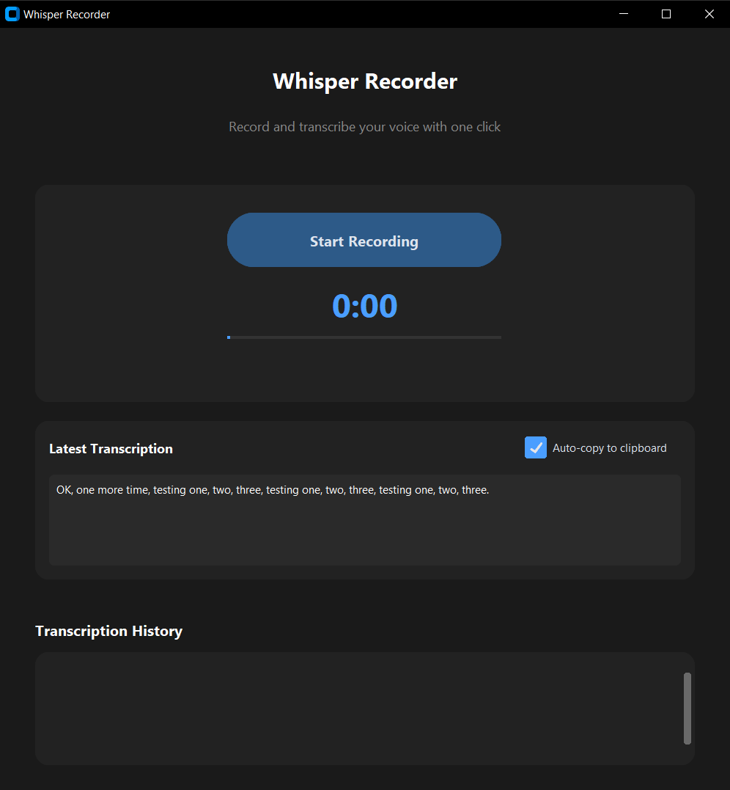
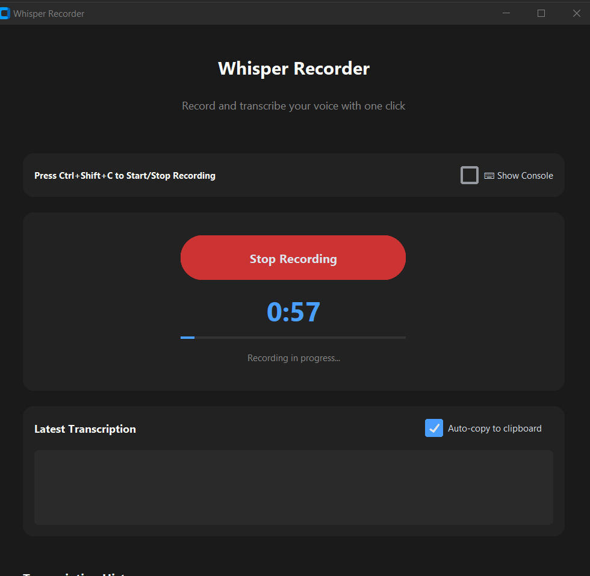
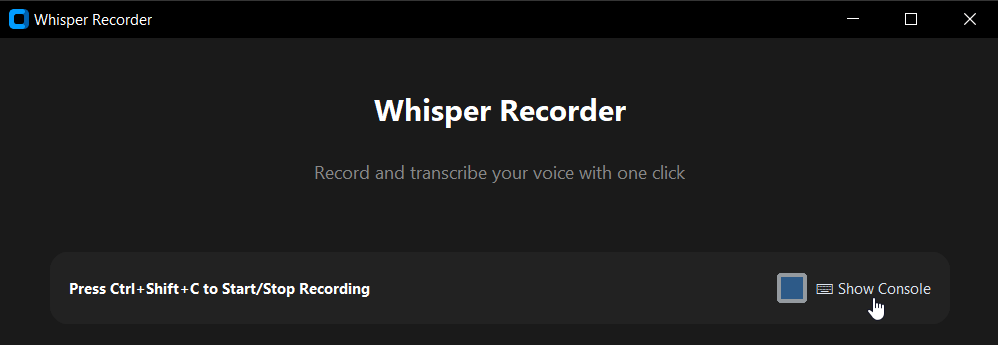
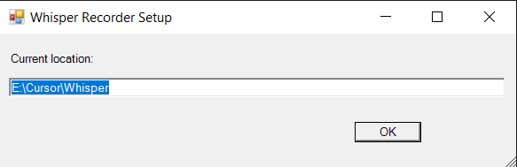

# Whisper Recorder
<!-- Last updated: 2024-02-11 -->

A modern desktop application that records audio and transcribes it in real-time using OpenAI's Whisper model (via whisper.cpp). Features a clean, dark-themed interface and global hotkey support.

## Screenshots

### Main Interface

*The main application window showing the recording interface, latest transcription, and history.*

### Recording in Progress

*Recording in progress with timer and progress bar.*

### Settings and Controls

*Settings panel showing hotkey information and console toggle.*

### Initial Setup


*The setup wizard will help you configure the application for your system.*

## Features

- **One-Click Recording**: Start/stop recording with Ctrl+Shift+C (works even when minimized)
- **Real-Time Feedback**: Visual timer and progress indicator during recording
- **Instant Transcription**: Automatic transcription after recording stops
- **Auto-Copy**: Automatically copy transcriptions to clipboard
- **History**: Keep track of all your transcriptions with timestamps
- **Dark Theme**: Modern, eye-friendly dark interface
- **Offline Processing**: All transcription happens locally using whisper.cpp

## Prerequisites

- Windows 10/11
- Python 3.8 or higher

## Installation & Setup

1. Download and extract the latest release from GitHub
2. Double-click `setup.bat` to launch the setup wizard
3. In the setup window (shown above), you'll see your current installation path
   - You can keep this path by clicking "OK"
   - Or enter a different path if you prefer another location
4. The setup will:
   - Configure the application for your system
   - Create necessary directories
   - Set up file paths correctly
5. After setup completes, run `run_whisper.bat` to start the application
   - Note: The app needs admin privileges for global hotkeys to work

## Usage

1. Recording:
   - Press Ctrl+Shift+C to start recording
   - Press Ctrl+Shift+C again to stop recording
   - Maximum recording duration is 60 seconds

2. Transcription:
   - Transcription starts automatically when recording stops
   - The latest transcription appears in the top box
   - Enable "Auto-copy to clipboard" to automatically copy transcriptions

3. History:
   - All transcriptions are saved with timestamps
   - Use the "Copy" button next to each transcription to copy it
   - History is preserved between sessions

4. Console Access:
   - Use the "⌨ Show Console" checkbox to view debug information
   - Helpful for troubleshooting if issues occur

## Technologies Used

This project stands on the shoulders of giants:

### Core Technologies
- [OpenAI Whisper](https://github.com/openai/whisper) - The foundational speech recognition model
- [whisper.cpp](https://github.com/ggerganov/whisper.cpp) by [Georgi Gerganov](https://github.com/ggerganov) - Incredible C++ port of Whisper for CPU inference
- [CustomTkinter](https://github.com/TomSchimansky/CustomTkinter) by [Tom Schimansky](https://github.com/TomSchimansky) - Modern UI framework

### Python Libraries
- [PyAudio](https://people.csail.mit.edu/hubert/pyaudio/) - Audio recording
- [keyboard](https://github.com/boppreh/keyboard) by [BoppreH](https://github.com/boppreh) - Global hotkey support
- [pyperclip](https://github.com/asweigart/pyperclip) by [Al Sweigart](https://github.com/asweigart) - Clipboard operations

## Project Structure

```
whisper-recorder/
├── whisper.cpp/           # Whisper CPP with pre-built executable
│   ├── models/           # Contains the Whisper model file
│   └── build/bin/        # Contains the whisper-cli.exe
├── recordings/           # Directory for temporary recordings and transcripts
├── screenshots/          # Application screenshots
├── requirements.txt      # Python dependencies
├── run_whisper.bat      # Application launcher (with admin privileges)
├── run_whisper.txt      # Reference for non-admin launch command
├── setup.bat            # Setup script with GUI
├── whisper_recorder.py  # Main application
└── whisper_cpp_wrapper.py # Wrapper for whisper.cpp
```

## Files for GitHub

Upload these files to GitHub:
- `whisper_recorder.py`
- `whisper_cpp_wrapper.py`
- `requirements.txt`
- `run_whisper.bat` (admin version)
- `run_whisper.txt` (non-admin reference)
- `setup.bat`
- `README.md`
- `LICENSE`
- `.gitignore`
- `screenshots/` directory (with interface screenshots)
- Pre-built `whisper.cpp` directory with model

## Contributing

1. Fork the repository
2. Create your feature branch (`git checkout -b feature/amazing-feature`)
3. Commit your changes (`git commit -m 'Add some amazing feature'`)
4. Push to the branch (`git push origin feature/amazing-feature`)
5. Open a Pull Request

## License

This project is licensed under the MIT License - see the LICENSE file for details.

## Credits and Acknowledgments

### Core Technology Credits
- **OpenAI Team** for creating [Whisper](https://github.com/openai/whisper), the foundational speech recognition model
- **Georgi Gerganov** ([@ggerganov](https://github.com/ggerganov)) for creating [whisper.cpp](https://github.com/ggerganov/whisper.cpp), making efficient CPU inference possible
- **Tom Schimansky** ([@TomSchimansky](https://github.com/TomSchimansky)) for [CustomTkinter](https://github.com/TomSchimansky/CustomTkinter), enabling the modern UI

### Additional Libraries
- **BoppreH** for the [keyboard](https://github.com/boppreh/keyboard) library
- **Al Sweigart** for [pyperclip](https://github.com/asweigart/pyperclip)
- **PyAudio Team** for [PyAudio](https://people.csail.mit.edu/hubert/pyaudio/)

### Special Thanks
- The open-source community for their invaluable contributions
- All contributors who help improve this project

## Support

If you find this project helpful, please consider:
- Starring the repository
- Contributing to the code
- Reporting issues
- Supporting the core technologies this project relies on:
  - [OpenAI Whisper](https://github.com/openai/whisper)
  - [whisper.cpp](https://github.com/ggerganov/whisper.cpp)
  - [CustomTkinter](https://github.com/TomSchimansky/CustomTkinter) 
